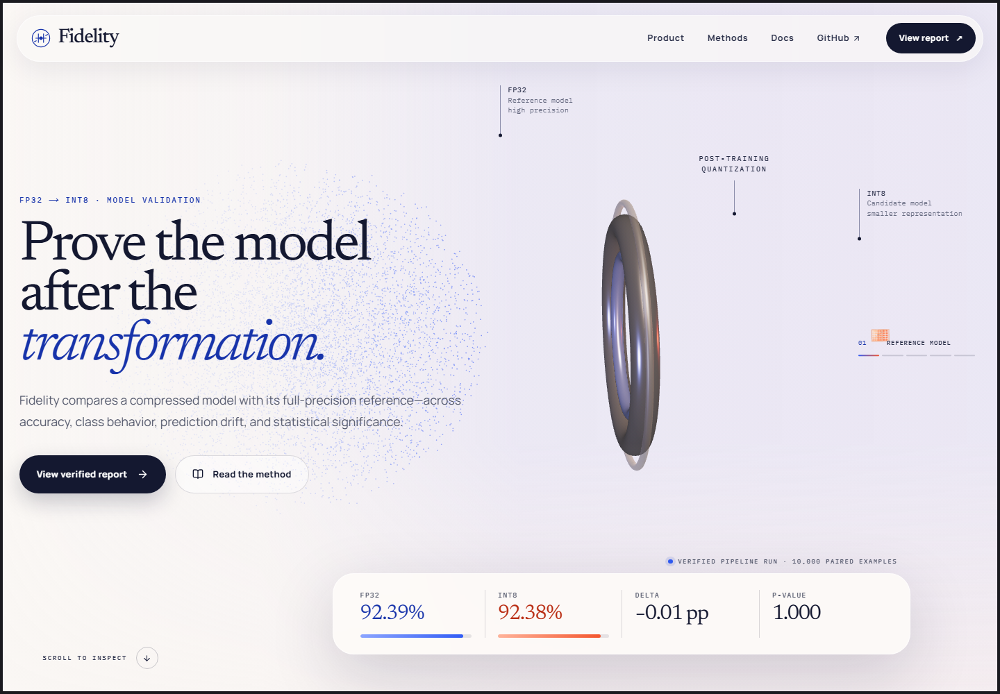
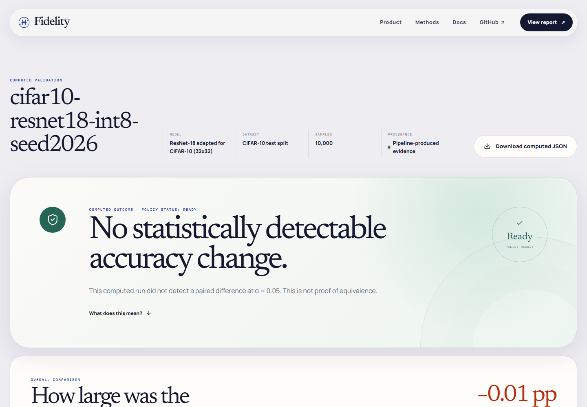

# Fidelity

> Prove the model after the transformation.

Fidelity is an end-to-end validation system for one practical model-release
question: after an FP32 classifier is quantized to INT8, what evidence supports
shipping the transformed model?

The project combines a cinematic, accessible Next.js experience with a real
PyTorch quantization pipeline, a dependency-light Python validation engine, and
an optional read-only FastAPI delivery boundary. Metrics and verdicts originate
in the Python report pipeline; the browser presents that evidence but never
manufactures a computed result.



## Project status

| Surface | Current behavior |
| --- | --- |
| Product site | Complete multi-route experience with responsive layouts, motion, and reduced-motion/WebGL fallbacks. |
| Demo report | `/runs/demo` uses a tracked illustrative fixture and labels it as demo data throughout the interface and exported JSON. |
| Computed report | `/runs/cifar10-resnet18-int8-seed2026` serves the checked, reproducible portfolio run. `/runs/latest` remains the live optional-API boundary and fails closed when evidence is unavailable. |
| ML pipeline | Trains or resumes a CIFAR-10 ResNet-18, performs FX static INT8 post-training quantization, evaluates both models on the same ordered test examples, and publishes a validated report. |
| Validation boundary | Recomputes and verifies report arithmetic, paired evidence, policy output, schema, and provenance before a report is written or served. |
| Automation | GitHub Actions runs Python quality gates, real CPU quantization/export tests, web unit/build checks, and Chromium, Firefox, and WebKit accessibility journeys. |

The demo fixture remains illustrative and cannot be mistaken for computed
evidence. The featured result below was produced by the executable pipeline,
validated by the Python serializer, and checked in with its exact metadata and
artifact hashes.

## Verified portfolio run

The tracked `cifar10-resnet18-int8-seed2026` run trained a CIFAR-adapted
ResNet-18 for 20 epochs with seed 2026, calibrated static INT8 quantization on
2,048 training examples, and evaluated FP32 plus the reloaded standalone INT8
artifact on the same ordered 10,000-example held-out test split.

| Evidence | Observed result |
| --- | ---: |
| FP32 top-1 accuracy | 92.39% (9,239 / 10,000) |
| INT8 top-1 accuracy | 92.38% (9,238 / 10,000) |
| Accuracy change | -0.01 percentage points |
| Paired Wilcoxon signed-rank | p = 1.0; 39 non-zero pairs; exact permutation |
| Mean confidence drift | 0.0004199851152058104 nats |
| Backend policy | `ready`; no crossed guardrails |



Open the [interactive verified report](http://localhost:3000/runs/cifar10-resnet18-int8-seed2026),
or inspect the exact [report](web/lib/verified-runs/cifar10-resnet18-int8-seed2026/report.json),
[metadata](web/lib/verified-runs/cifar10-resnet18-int8-seed2026/metadata.json),
and [reproduction record](web/lib/verified-runs/cifar10-resnet18-int8-seed2026/README.md).
The recorded `ready` status means only that this run stayed within its
serialized policy thresholds. It is not proof of equivalence or a general
model-safety certification.

## Product routes

- `/` - scroll-scrubbed FP32-to-INT8 story with an interactive WebGL particle
  system and a local static poster fallback.
- `/product` - workflow, report anatomy, and validation scope.
- `/methods` - paired evaluation, confidence drift, statistical interpretation,
  and policy thresholds.
- `/docs` - report contract, architecture, integrity rules, and local service
  setup.
- `/runs/demo` - clearly labeled, illustrative dashboard fixture for reviewing
  the user experience without running a model.
- `/runs/cifar10-resnet18-int8-seed2026` - bundled, pipeline-produced evidence
  for the verified portfolio run above.
- `/runs/latest` - latest valid computed report, or an honest unavailable state
  when the report service is not configured.

Unknown run IDs return a not-found page instead of being mapped to plausible
evidence.

## How evidence moves through the system

```text
CIFAR-10 training split                         held-out CIFAR-10 test split
        |                                                   |
        +--> train/resume FP32 ResNet-18                    |
        |                                                   |
        +--> deterministic calibration sample               |
                         |                                  |
                         v                                  v
                FX static INT8 PTQ             same ordered examples for
                    (CPU engine)                 FP32 and INT8 evaluation
                         |                                  |
                         +---------------+------------------+
                                         |
                                         v
                       validation/ report builder + policy
                                         |
                           strict JSON verification/write
                                         |
                +------------------------+------------------------+
                |                                                 |
                v                                                 v
     artifacts/latest-report.json                       optional FastAPI
                                                                  |
                                                        no-store server fetch
                                                                  |
                                                                  v
                                                        Next.js `/runs/latest`
```

The candidate and reference models are evaluated on CPU so the comparison
isolates quantization rather than mixing CPU/GPU execution differences.
Calibration draws from the training split; the test split remains held out for
the paired comparison.

## Trust boundaries

Fidelity deliberately separates presentation from evidence production:

- `pipeline/` owns CIFAR-10 loading, deterministic sampling, training/resume,
  checkpointing, FX PTQ, evaluation, artifact fingerprints, and atomic publish.
- `quantize/` contains reusable model conversion and classifier-evaluation
  primitives. It will not report accuracy without running supplied data.
- `validation/` derives aggregate and per-class accuracy, mean
  `KL(reference || candidate)` confidence drift, exact paired significance
  evidence for binary correctness differences, and the policy verdict.
- `api/` loads the report from disk and serves only a schema-valid artifact with
  `provenance: { "kind": "computed", "computed": true }`. Missing reports
  return `404`; invalid, unreadable, or demo artifacts return a generic `503`.
- `web/` performs a second strict Zod parse. Its server-only fetch is uncached,
  time-bounded, and fails closed to the unavailable state.

The default policy can return `ready`, `review`, or `blocked`; its thresholds
are documented in [validation/POLICY.md](validation/POLICY.md). A `ready` result
means only that this run did not cross those configured guardrails. It does not
prove model equivalence or establish robustness, fairness, privacy, safety,
calibration, compliance, latency, or fitness for a particular deployment.

## Quick start: inspect the product

The web application requires Node.js 20.9 or newer. CI uses Node.js 22.

```bash
cd web
npm ci
npm run dev
```

Open <http://localhost:3000>. This path needs no API key; both the verified run
and labeled demo remain available when the Python service is not running.

## Produce a computed report

The validation engine and API support Python 3.11 or newer. The executable ML
pipeline supports CPython 3.11-3.13 and pins its PyTorch dependencies.

Create an environment and install the validation/API tooling:

```powershell
python -m venv .venv
.\.venv\Scripts\Activate.ps1
python -m pip install --upgrade pip
python -m pip install -r tests/python/requirements.txt -r api/requirements.txt
```

Install PyTorch for the machine that will run the model. For a CPU-only setup:

```powershell
python -m pip install --index-url https://download.pytorch.org/whl/cpu -r pipeline/requirements.txt
```

For CUDA training, select the matching command from the official PyTorch
installer instead. INT8 conversion and evaluation still use quantized CPU
operators.

Run the complete training and validation path:

```powershell
python -m pipeline --download --epochs 20 --device auto
```

The command creates `artifacts/runs/<run-id>/` with:

- `fp32-checkpoint.pt` - atomic model, optimizer, epoch, seed, and training
  configuration checkpoint;
- `int8-fx-static.torchscript.pt` - reloadable quantized inference module;
- `validation-report.json` - strict computed evidence consumed by the product;
- `metadata.json` - configuration, runtime versions, training observations,
  dataset/calibration/test fingerprints, evaluated-output hashes, and artifact
  SHA-256 values.

Only after the run record is complete does the pipeline atomically publish the
same validated report to `artifacts/latest-report.json`. `artifacts/`, `data/`,
and model files are git-ignored by default.

Resume an interrupted training run while preserving the original total-epoch
schedule:

```powershell
python -m pipeline --download --resume artifacts/runs/<run-id>/fp32-checkpoint.pt --epochs 20
```

Evaluate an existing Fidelity checkpoint without additional optimization:

```powershell
python -m pipeline --no-download --epochs 0 --resume artifacts/runs/<run-id>/fp32-checkpoint.pt --run-id <evaluation-run-id>
```

Run `python -m pipeline --help` for batch size, calibration, seed, device,
backend, checkpoint cadence, data path, and artifact path controls. A fixed seed
and recorded hashes make a run auditable, but do not imply bit-for-bit identity
across different PyTorch, driver, operating-system, or hardware versions.

## Connect `/runs/latest`

The API defaults to `artifacts/latest-report.json`, so no backend variable is
needed for the standard pipeline output. From the repository root:

```powershell
python -m uvicorn api.app:app --reload --port 8000
```

If the report lives elsewhere, set `FIDELITY_REPORT_PATH` in the API process.
Relative paths resolve from the repository root.

Then create `web/.env.local` with the server-only API origin:

```dotenv
FIDELITY_API_BASE_URL=http://127.0.0.1:8000
```

Restart the Next.js development server and visit
<http://localhost:3000/runs/latest>. Useful service endpoints are:

- `GET /api/health` - API health plus whether a valid computed report is
  available;
- `GET /api/reports/latest` - latest verified computed report;
- `GET /api/docs` - local OpenAPI explorer.

The root [.env.example](.env.example) documents both process variables;
`web/.env.example` can be copied directly to `web/.env.local`.

## Quality gates

Run the same Python checks used by CI:

```powershell
python -m pytest tests/python
python -m ruff check api validation pipeline quantize tests/python
python -m ruff format --check api validation pipeline quantize tests/python
python -m mypy validation api
```

Run the web checks:

```bash
cd web
npm run lint
npm run typecheck
npm run test:coverage
npm run build
npx playwright install chromium firefox webkit
npm run test:e2e
```

CI keeps fast Python validation checks separate from a focused CPU-only ML job.
The latter installs the official CPU PyTorch wheels and executes real FX PTQ,
TorchScript export/reload, checkpoint, and deterministic runtime contracts.
The measured UI performance and frame-pacing methodology are recorded in
[docs/PERFORMANCE.md](docs/PERFORMANCE.md).

## Repository map

```text
.github/      CI and dependency-update automation
api/          Optional read-only FastAPI report adapter
pipeline/     Reproducible CIFAR-10 training-to-evidence workflow
quantize/     Reusable PyTorch FX PTQ and evaluation primitives
validation/   Metrics, exact paired test, policy, schema, and serializer
tests/python/ Python unit, contract, API, and optional PyTorch tests
web/          Next.js App Router product, report UI, unit tests, and Playwright tests
```

## Cost and external services

Fidelity has no paid API dependency, no LLM call in its runtime, and no required
secret key. The interface, validation service, and pipeline can all run locally
with open-source packages. Network access is needed only to install dependencies
and, when requested, download CIFAR-10; hosting choices may have their own costs.

Keep private datasets, model weights, and generated artifacts out of source
control unless their licenses and sharing terms explicitly permit publication.

## Project identity

This is an independent portfolio project and is not affiliated with, endorsed
by, or sponsored by Fidelity Investments or any of its affiliates.

Read [CONTRIBUTING.md](CONTRIBUTING.md) before opening a change and
[SECURITY.md](SECURITY.md) for responsible vulnerability reporting. The code is
available under the [MIT License](LICENSE).
