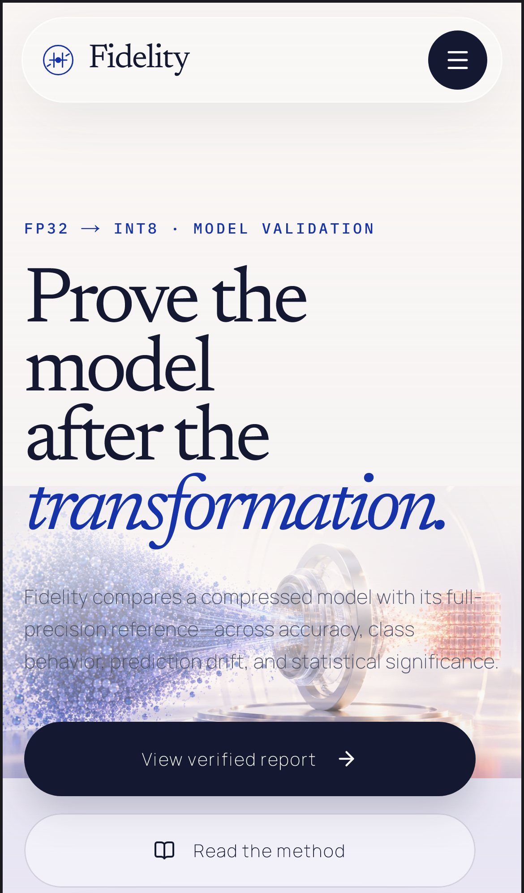

# Performance evidence

Fidelity treats the cinematic WebGL scene as progressive enhancement. The
semantic product story and its generated poster render first; motion is added
only when the browser, viewport, visibility state, and user preference permit
it.

## Measurement conditions

These results were collected on September 5, 2026 from a local optimized Next.js
production build on Windows, using Lighthouse 13.4.1 and headless Chromium.
They are synthetic lab measurements, not field data, and should not be read as
a guarantee for every device or network. They also predate the later visual
revision that increased particle density and changed compact-scene startup, so
the tables are retained as historical tuning evidence rather than current
performance claims. Re-run the procedure below before quoting fresh numbers for
the present scene.

The home-page final values are medians from three runs. The pre-change mobile
column is a single baseline taken before compact-scene deferral, so it is useful
as a directional comparison rather than a formal benchmark.

| Home page | Mobile baseline | Mobile final median | Desktop final median |
| --- | ---: | ---: | ---: |
| Performance score | 67 | 88 (range 79-88) | 88 (range 86-94) |
| First Contentful Paint | 0.91 s | 0.91 s | 0.25 s |
| Largest Contentful Paint | 3.61 s | 3.76 s | 0.90 s |
| Total Blocking Time | 1.16 s | 0.13 s | 0.28 s |
| Cumulative Layout Shift | 0 | 0 | 0 |
| Speed Index | 0.91 s | 1.48 s | 0.40 s |
| Transfer size | 879 kB | 636 kB | 1,085 kB |
| Main-thread work | 3.73 s | 1.29 s | 1.18 s |

Every recorded home-page run scored 100 for Lighthouse accessibility, best
practices, and SEO. Mobile LCP varied substantially between runs, including one
5.04-second result; the median above is reported rather than replacing it with
the fastest sample.

The evidence-heavy verified report was also checked separately:

| Verified report | Mobile | Desktop |
| --- | ---: | ---: |
| Performance score | 89 | 100 |
| Accessibility / best practices / SEO | 100 / 100 / 100 | 100 / 100 / 100 |
| First Contentful Paint | 1.06 s | 0.29 s |
| Largest Contentful Paint | 3.54 s | 0.72 s |
| Total Blocking Time | 0.15 s | 0 s |
| Cumulative Layout Shift | 0 | 0 |
| Transfer size | 558 kB | 558 kB |

## Frame-pacing probe

A small Playwright probe sampled 180 consecutive `requestAnimationFrame`
intervals after a 750 ms scene warm-up. This is a browser scheduling sample,
not a GPU benchmark or a fixed-FPS claim.

| Viewport and state | Median interval | p95 interval | Frames over 25 ms |
| --- | ---: | ---: | ---: |
| Desktop, live scene | 16.7 ms | 33.2 ms | median 9 / 180 |
| Compact, after first interaction | 16.7 ms | 16.8 ms | 0 / 180 |

Desktop samples were sensitive to shared-machine load: the count over 25 ms
ranged from 3 to 63 across the latest three runs. That variance is retained
here because a single smooth capture would overstate certainty.

## Current controls that bound the visual cost

- The Three.js bundle is dynamically loaded. On compact viewports, the optimized
  poster is the initial visual and the live scene is requested after 350 ms or
  sooner after the first scroll, pointer, or keyboard interaction.
- The current desktop particle field uses 12,000 deterministic particles.
  Compact mode uses 3,200, one device pixel per CSS pixel, lower-poly aperture
  rings, simpler materials, and a thinner voxel edge pass.
- Desktop device-pixel ratio is capped at 1.5. The canvas stops rendering when
  the hero leaves the viewport, the document is hidden, WebGL is unavailable,
  or reduced motion is requested.
- Poster dimensions are reserved, so swapping to the live canvas does not move
  page content. The hidden poster also stops contributing a large blurred
  compositor layer after WebGL is live.
- The report route does not load the Three.js experience at all.

## Reproducing the checks

Build and serve the web application before profiling:

```bash
cd web
npm ci
npm run build
npm run start
```

Run Lighthouse against `http://localhost:3000` and the bundled verified report
at `http://localhost:3000/runs/cifar10-resnet18-int8-seed2026`. For functional
coverage of the same fallbacks and interaction boundary, run:

```bash
npm run test:e2e
```

The original one-off frame-pacing probe was not committed. Its table above is a
historical observation, not a directly reproducible benchmark artifact. A fresh
performance pass should add a tracked probe and record its exact command before
publishing new frame-pacing numbers.

Real-user monitoring would be the next step after deployment. In the historical
pass above, compact Lighthouse measured the poster-first path; the one-off
frame-pacing sample and browser journeys supplied additional WebGL context that
the initial-load score could not provide.

## Compact visual baseline

The compact first paint keeps the full art direction without requiring WebGL:


